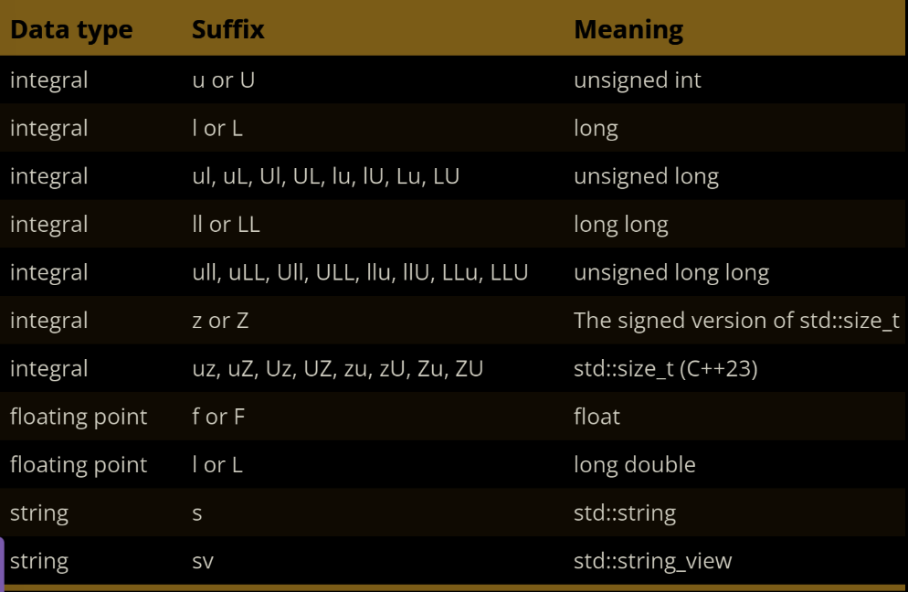
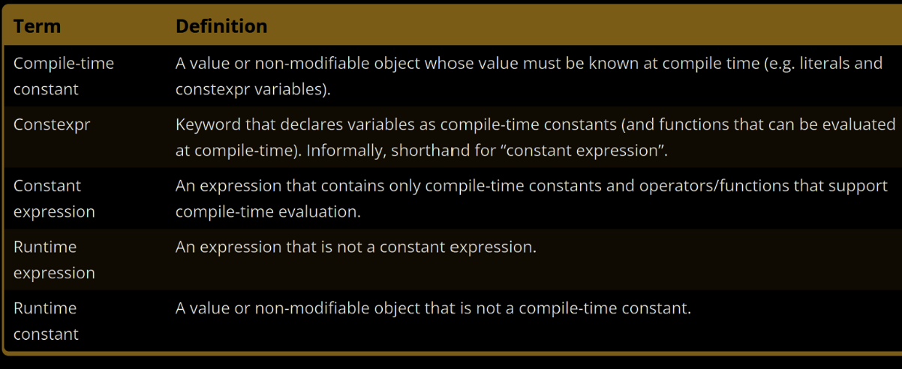

C++ language guide
==================

***This is a guide for programmers who already know other object oriented langauges.***

**Author:** *Dávid Tokar, notes taken from https://www.learncpp.com*

# Basics:

There are two general exceptions to portability:

- First, many operating systems, such as Microsoft Windows, contain platform-specific capabilities you can use in your code. These can make writing a program for a specific operating system much easier but at the expense of portability.
- The second is that some compilers also support compiler-specific extensions. If you use these, your programs won’t be able to be compiled by other compilers that don’t support the same extensions without modification.

Linking: The linker combines the object files and produces the desired output file (typically executable). This process is called linking.

- First, the linker reads each object file the compiler generates and ensures they are valid.
- Second, the linker ensures all cross-file dependencies are correctly resolved. For example, if you define something in one .cpp file and then use it in a different .cpp file, the linker connects the two. If the linker cannot connect a reference to something with its definition, you’ll get a linker error, and the linking process will abort.
- Third, the linker is also capable of linking library files. A library file is a collection of precompiled code that has been “packaged up” for reuse in other programs.

## Compiling your C++ program:

```
g++ Compiling Flags Cheat Sheet
-g: Generates debugging information.
-ggdb: Debug info specifically for gdb, includes additional details for better debugging.
-O0: No optimization, easiest for debugging.
-O1: Basic optimization.
-O2: Optimization that is moderate to high.
-O3: Aggressive optimization may increase code size and complexity.
-Os: Optimize for size, reduces code footprint.
-DNDEBUG: Disables debugging code (e.g., assert()).
-Wall: Enables most compiler warnings.
-Werror: Treats warnings as errors.
-std=c++XX: Specifies the C++ standard (e.g., -std=c++17).
-pthread: Enables multi-threading support with the pthreads library.
-I<directory>: Adds a directory to the list of paths to search for headers.
-L<directory>: Adds a directory to the list of paths to search for libraries.
-l<library>: Links with a specific library (e.g., -lm for the math library).
```

**For testing:** g++ -g -O0 -Wall -Wextra -std=c++17 -o my_test_app main.cpp
**For production:** g++ -O2 -DNDEBUG -Wall -Werror -std=c++17 -o my_production_app main.cpp

**Statements:** A statement is a type of instruction that causes the program to perform some action. Most (but not all) statements in C++ end in a semicolon.

There are many different kinds of statements in C++:

- Declaration statements
- Jump statements
- Expression statements
- Compound statements
- Selection statements (conditionals)
- Iteration statements (loops)
- Try blocks

A **function** is a collection of statements executed sequentially (in order, from top to bottom).

Every C++ program must have a particular **main function**. When the program is run, the statements inside of main are executed in sequential order.

Programs typically terminate (finish running) after the last statement inside function main has been executed (though programs may abort early in some circumstances or do some cleanup afterward).

In programming, a function's name (or object, type, template, etc.…) is called its **identifier**.

## Dissecting Hello world!

```
#include <iostream>  // Line 1: Preprocessor directive that includes the iostream library. Needed to use std::cout for console output.

int main() {  // Line 3: Defines the main function, required in every C++ program.

std::cout << "Hello world!";

return 0;  // Line 6: Returns 0 to indicate successful execution to the OS.

}  // Lines 4 & 7: Curly braces enclose the main function body.`
```

An **object** is a storage region (usually memory) that can store a value.
A **variable** is an object that has a name.
An **identifier** is the name that a variable is accessed by.

We use a particular declaration statement called a **definition** to create a variable. The variable will be instantiated when the program is run (called **runtime**).
**Instantiation** is a fancy word that means the object will be created and assigned a memory address.

After a variable has been defined, you can give it a value (in a separate statement) using the *=* operator. This process is called **assignment**, and the *=* operator is called the **assignment operator**. By default, the assignment copies the value on the right-hand side of the *=* operator to the variable on the left-hand side of the operator. This is called a copy assignment.

## Initialization:

There are six basic ways to initialize variables in C++:

```
int a;           // no initializer (default initialization)
```

This is called **default initialization** when no initializer is provided (such as for variable a above). In most cases, default initialization performs no initialization and leaves a variable with an indeterminate value.

```
int b = 5;     // initial value after equals sign (copy initialization)
```

**Copy initialization** had fallen out of favor in modern C++ due to needing to be more efficient than other initialization forms for some complex types. However, C++17 remedied the bulk of these issues, and copy initialization is now finding new advocates. You will also find it used in older code (especially code ported from C), or by developers who simply think it looks more natural and is easier to read.

```
int c( 6 );     // initial value in parenthesis (direct initialization)
```

**Direct initialization** was introduced to allow for more efficient initialization of complex objects (those with class types, which we’ll cover in a future chapter). Like copy initialization, direct initialization had fallen out of favor in modern C++, mainly because it was superseded by list initialization. However, we now know that list initialization has a few quirks, so direct initialization is again useful in some instances.

**List initialization** methods (C++11) (preferred):

```
int d { 7 };    // initial value in braces (direct list initialization)

int e = { 8 }; // initial value in braces after equals sign (copy list initialization)

int f {};         // initializer is empty braces (value initialization)
```

Prior to the introduction of list initialization, some types of initialization required copy initialization, and other types required direct initialization. List initialization was introduced to provide a more consistent initialization syntax (which is why it is sometimes called “uniform initialization”) that works in most cases.

The primary benefit of list initialization is that “narrowing conversions” are disallowed. If you try to list initialize a variable using a value that the variable can not safely hold, the compiler must produce a diagnostic (usually an error). For example:

```
int w1 { 4.5 }; // compile error: list init does not allow narrowing conversion of 4.5 to 4

int w2 = 4.5; // compiles: copy init initializes width with 4

int width {}; // value initialization / zero initialization to value 0

int a, b = 5; // wrong (a is not initialized!) int a = 5, b = 5; // correct
```

## Operator basics

```
#include <iostream>

int main()
{

std::cout << "Enter two numbers: ";

int x{};

std::cin >> x;

int y{};

std::cin >> y;

std::cout << "You entered " << x << " and " << y << '\n';

return 0;

}
```

- When std::cin >> x is encountered, the program will wait for input. Enter 4 5. The input 4 5\n goes into the input buffer, but only the 4 is extracted to variable x (extraction stops at the space).
- When std::cin >> y is encountered, the program does not wait for input. Instead, the 5 that is still in the input buffer is extracted to variable y. The program then prints "You entered 4 and 5."
- In run 2, the program didn’t wait for the user to enter additional input when extracting to variable y because there was already prior input in the input buffer that could be used.

Here’s a simplified view of how operator >> works for input:

- First, leading whitespace (spaces, tabs, and newlines at the front of the buffer) is discarded from the input buffer. This will discard any unextracted newline character remaining from a prior input line.
- If the input buffer is empty, operator >> will wait for the user to enter more data. Leading whitespace is again discarded.
- Operator>> then extracts as many consecutive characters as possible until it encounters either a newline character (representing the end of the line of input) or a character not valid for the extracted variable.

A **literal** (also known as a literal constant) is a fixed value inserted directly into the source code.

The number of operands that an operator takes as input is called the operator’s **arity**.

- Ternary operators act on three operands. There is only one of these in C++ (the conditional operator).
- Nullary operators act on zero operands. There is only one of these in C++ (the throw operator).

Note that some operators have multiple meanings depending on how they are used. For example, operator- has two contexts. It can be used in unary form to invert a number’s sign (e.g. to convert 5 to -5, or vice versa), or it can be used in binary form to do subtraction (e.g. 4 - 3).

Some operators have additional behaviors. An operator (or function) with some observable effect beyond producing a return value is said to have a **side effect**. For example, when *x = 5* is evaluated, the assignment operator has the side effect of assigning the value 5 to variable x.

For the operators we call primarily for their side effects (e.g. operator= or operator<<), it’s not always obvious what return values they produce (if any). For example, what return value would you expect *x = 5* to have?

Both *operator=* and *operator<<* (when used to output values to the console) return their left operand. Thus, *x = 5* returns *x*, and *std::cout << 5* returns *std::cout*. This is done so that these operators can be chained.

For example, *x = y = 5* evaluates as *x = (y = 5)*. First *y = 5* assigns *5* to *y*. This operation then returns *y*, which can then be assigned to *x*.

Note that expressions do not end in a semicolon, and cannot be compiled by themselves. For example, if you were to try compiling the expression *x = 5*, your compiler would complain (probably about a missing semicolon).

## The main function

**Rather, expressions are always evaluated as part of statements.**

Statements are used when we want the program to perform an action. Expressions are used when we want the program to calculate a value.

Unlike some other programming languages, in C++, **functions cannot be defined inside other functions**.

The return value from *main()* is sometimes called a status code (or less commonly, an exit code, or rarely a return code). The status code is used to signal whether your program was successful or not. By convention, a status code of 0 means the program ran normally (meaning the program executed and behaved as expected).

```
#include <cstdlib> // for EXIT_SUCCESS and EXIT_FAILURE 

int main() {
return EXIT_SUCCESS;
}
```

Not returning from a function produces undefined behavior.

The only exception to the rule that a value-returning function must return a value via a return statement is for *function main()*. The *function main()* will implicitly return the value 0 if no return statement is provided.

When a function is called, all of its parameters are created as variables, and the value of each of the arguments is copied into the matching parameter (using copy initialization). This process is called pass-by-value. Function parameters that utilize pass-by-value are called value parameters.

In a function definition, the name of a function parameter is optional. Therefore, in cases where a function parameter needs to exist but is not used in the function's body, you can simply omit the name. A parameter without a name is called an unnamed parameter:

```
void doSomething(int) // ok: unnamed parameter will not generate warning { }
```

Function parameters are also generally considered to be local variables, and we will include them as such:

- Function parameters are created and initialized when the function is entered, and variables within the function body are created and initialized at the point of definition.
- Local variables are destroyed in the opposite order of creation at the end of the set of curly braces in which it is defined (or for a function parameter, at the end of the function).

## Scope and lifetime

**What happens when an object is destroyed?**
In most cases, nothing. The destroyed object becomes invalid, and further use of the object will result in undefined behavior. At some point after destruction, the memory the object uses will be freed up for reuse.

An identifier’s **scope** determines where the identifier can be seen and used within the source code. Scope is a **compile-time property**, and trying to use an identifier when it is not in scope will result in a compile error.

**Lifetime is a runtime property, and scope is a compile-time property.**

A temporary object (also sometimes called an anonymous object) is an unnamed object created by the compiler to temporarily store a value.

```
std::cout << getValueFromUser() << '\n'; // where does the returned value get stored?
```

Temporary objects have no scope and are destroyed at the end of the expression in which they are created. When a temporary object is used to initialize a variable, the initialization happens before the temporary destruction. However, in modern C++, the compiler often skips creating the temporary and initializes the variable directly with the return value.

## Definitions and declarations

A **forward declaration** allows us to inform the compiler about the existence of an identifier before actually defining it.

A **declaration** tells the compiler about the existence of an identifier and its associated type information.

A **definition** is a declaration that implements (for functions and types) or instantiates (for variables) the identifier.

**In C++, all definitions are declarations.**
Therefore *int x;* is both a definition and a declaration. **Conversely, not all declarations are definitions.** Declarations that aren’t definitions are called **pure declarations**.

There are a few cases where the compiler must be able to see a full definition to use an identifier (such as for template definitions and type definitions.

The one definition rule (or ODR for short):

- Within a file, each function, variable, type, or template in a given scope can only have one definition. Definitions occurring in different scopes (e.g. local variables defined inside other functions or functions defined inside different namespaces) do not violate this rule.
- Within a program, each function or variable in a given scope can only have one definition. This rule exists because programs can have more than one file. Functions and variables not visible to the linker are excluded from this rule.
- Types, templates, inline functions, and inline variables are allowed to have duplicate definitions in different files, so long as each definition is identical.

A **function prototype** is a declaration statement that includes a function’s name, return type, parameter types, and optionally the parameter names.

```
#include <iostream>
int add(int x, int y);
int main()
{
    std::cout << "3+4=" << add(3, 4) << '\n';
    return 0;
}
int add(int x, int y, int z)
{
    return x + y + z;
}
```

Doesn’t link. The compiler will match the forward declaration of add to the function call to add() in main(). However, no add() function that takes two parameters was ever implemented (we only implemented one that took 3 parameters), so the linker will complain.

The compiler does not compile the listed files in any order!

- It allows the source files of a project to be compiled in any order.
- When we change a source file, only that source file needs to be recompiled.
- It reduces the possibility of naming conflicts between identifiers in different files.

**If the colliding identifiers are introduced into the same file, the result will be a compiler error. If the colliding identifiers are introduced into separate files belonging to the same program, the result will be a linker error.**
A scope region is an area of source code where all declared identifiers are considered distinct from names declared in other scopes.

A **namespace** provides another type of scope region (called namespace scope) that allows you to declare names inside of it for the purpose of disambiguation.

Any name that is not defined inside a class, function, or a namespace is considered to be part of an implicitly-defined namespace called the **global namespace** (sometimes also called the global scope).

The *::* symbol is an operator called the **scope resolution operator**.

## Preprocessor

The result is called a **translation unit** when the preprocessor has finished processing a code file.

The *#define* directive can be used to create a macro. In C++, a macro is a rule that determines how input text is converted into replacement output text.

There are two basic types of macros: **object-like macros, and function-like macros**.

Function-like macros act like functions, and serve a similar purpose. Their use is generally considered unsafe, and almost anything they can do can be done by a normal function.

Object-like macros can be defined in one of two ways:

```
#define IDENTIFIER

#define IDENTIFIER substitution_text
```

One more common use of conditional compilation involves using #if 0 to exclude a block of code from being compiled.

```
#define F00 9 // Here's a macro substitution
#ifdef F00 // This F00 does not get replaced with 9 because it's part of another preprocessor directive std::cout << F00 << '\n'; // This F00 gets replaced with 9 because it's part of the normal code 
#endif
```

In most cases, macro substitution does not occur when a macro identifier is used within another preprocessor command.

There is at least one exception to this rule, as most forms of **#if** **#elif** do substitution before the preprocessor command is resolved.

**Directives** are resolved before compilation, from top to bottom on a file-by-file basis.


```
#include <iostream> // Angled brackets tell the preprocessor to search for this header in the system include directories

#include "my_custom_header.h" // Custom header file written by us (hypothetical). Quotation marks tell the preprocessor to search for this file in the current project directory.
```

Using *g++*, you can use the -I option to specify an alternate include directory:

```g++ -o main -I/source/includes main.cpp```

Let’s say header A needs declarations from header B, but forgets to include it. In our code file, if we include header B before header A, our code will still compile! This is because the compiler will compile all the declarations from B before it compiles the code from A that depends on those declarations.

To maximize the chance that missing includes will be flagged by compiler, order your #includes as follows:
- The paired header file
- Other headers from your project
- 3rd party library headers
- Standard library headers

*#pragma once* serves the same purpose as header guards: to avoid a header file from being included multiple times. With traditional header guards, the developer is responsible for guarding the header (by using preprocessor directives #ifndef, #define, and #endif).

There is one known case where #pragma once will typically fail. Suppose a header file is copied so that it exists in multiple places on the file system. In that case, if somehow both copies of the header get included, header guards will successfully de-dupe the identical headers, but #pragma once won’t (because the compiler won’t realize they are similar content).

Because *#pragma once* is not defined by the C++ standard, some compilers may not implement it.

## Object sizes and overflow

Void is our first example of an incomplete type. An incomplete type is a type that has been declared but not yet defined.

**What does 64 bit architecture mean?**
It is the size of the registers in the CPU itself. Older architecture was 32 bit, which meant the biggest number it could store in an actual register was 32 binary digits in length (maximum number was 232 - 1)

The sizeof operator is a unary operator that takes either a type or a variable, and returns its size in bytes.

*sizeof* does not include dynamically allocated memory used by an object.


When dividing two integers, C++ works like you'd expect when the quotient is a whole number:

```
#include <iostream>
int main()
{
std::cout << 20/4 << '\n';
return 0;
}
```

This produces the expected result:
5

But let's look at what happens when integer division causes a fractional result:

```
#include <iostream>
int main()
{
    std::cout << 8/5 << '\n';
    return 0;
}
```

This produces a possibly unexpected result:


When doing division with two integers (called integer division), C++ always produces an integer result. Since integers can’t hold fractional values, any fractional portion is simply dropped (not rounded!).

The C++20 standard makes this blanket statement: “If during the evaluation of an expression, the result is not mathematically defined or not in the range of representable values for its type, the behavior is undefined”.

Oddly, the C++ standard explicitly says “a computation involving unsigned operands can never overflow”. This is contrary to general programming consensus that integer overflow encompasses both signed and unsigned use cases (cite). Given that most programmers would consider this overflow, we’ll call this overflow despite the C++ standard’s statements to the contrary.

If an unsigned value is out of range, it is divided by one greater than the largest number of the type, and only the remainder kept.

The number 280 is too big to fit in our 1-byte range of 0 to 255. 1 greater than the largest number of the type is 256. Therefore, we divide 280 by 256, getting 1 remainder 24. The remainder of 24 is what is stored.

It’s possible to wrap around the other direction as well. 0 is representable in a 2-byte unsigned integer, so that’s fine. -1 is not representable, so it wraps around to the top of the range, producing the value 65535. -2 wraps around to 65534. And so forth.

Unexpected behavior can result when you mix signed and unsigned integers. In C++, if a mathematical operation (e.g. arithmetic or comparison) has one signed integer and one unsigned integer, the signed integer will usually be converted to an unsigned integer. And the result will thus be unsigned. For example:

```
#include <iostream>
// assume int is 4 bytes
int main()
{
    signed int s {-1};
    unsigned int u {1 };
    if (s < u) // -1 is implicitly converted to 4294967295, and 4294967295 < 1 is false
        std::cout << "-1 is less than 1\n";
    else
        std::cout << "1 is less than -1\n"; // this statement executes
    return 0;
}
```

First, unsigned numbers are preferred when dealing with bit manipulation. They are also useful when well-defined wrap-around behavior is required (useful in some algorithms like encryption and random number generation).

C99 defined a set of fixed-width integers (in the stdint.h header) that are guaranteed to be the same size on any architecture.


C++ officially adopted these fixed-width integers as part of C++11. They can be accessed by including the `<cstdint>` header, where they are defined inside the std namespace.

The **fast types** (std::int_fast#_t and std::uint_fast#_t) provide the fastest signed/unsigned integer type with a width of at least # bits (where # = 8, 16, 32, or 64). For example, std::int_fast32_t will give you the fastest signed integer type that’s at least 32 bits. By fastest, we mean the integral type that can be processed most quickly by the CPU.

The **least types** (std::int_least#_t and std::uint_least#_t) provide the smallest signed/unsigned integer type with a width of at least # bits (where # = 8, 16, 32, or 64). For example, std::uint_least32_t will give you the smallest unsigned integer type that’s at least 32 bits.

`sizeof` returns a value of type `std::size_t`. `std::size_t` is an alias for an implementation-defined unsigned integral type. In other words, the compiler decides if std::size_t is an unsigned int, an unsigned long, an unsigned long long, etc…

sizeof must be able to return the byte-size of an object as a value of type std::size_t. Therefore, the byte-size of an object can be no larger than the largest value std::size_t can hold.

Note that by default, floating point literals default to type double. An f suffix is used to denote a literal of type float.


The 80-bit floating point type is a bit of a historical anomaly. On modern processors, it is typically implemented using 12 or 16 bytes (which is a more natural size for processors to handle).

The **precision** of a floating point type defines how many significant digits it can represent without information loss.

Significant digits show the precision of a number. Non-zero digits are always significant, zeros between them are too, but leading zeros are not. Trailing zeros in decimals are significant, but not in whole numbers without a decimal point.

When outputting floating point numbers, std::cout has a default precision of 6 -- that is, it assumes all floating point variables are only significant to 6 digits (the minimum precision of a float), and hence it will truncate anything after that.

We can override the default precision that std::cout shows by using an output manipulator function named std::setprecision(). Output manipulators alter how data is output, and are defined in the iomanip header.


```
#include <iomanip> // for output manipulator std::setprecision()
#include <iostream>
int main()
{
    std::cout << std::setprecision(17); // show 17 digits of
precision
    std::cout << 3.33333333333333333333333333333333333333f <<'\n';
// f suffix means float
    std::cout << 3.33333333333333333333333333333333333333 << '\n';
// no suffix means double
    return 0;
}
```
```
Outputs:
3.3333332538604736 
3.33333333333333335
```

We can override the default precision that std::cout shows by using an output manipulator function named std::setprecision(). Output manipulators alter how data is output, and are defined in the iomanip header.


Floating point numbers are tricky to work with due to non-obvious differences between binary (how data is stored) and decimal (how we think) numbers. Consider the fraction 1/10. In decimal, this is easily represented as 0.1, and we are used to thinking of 0.1 as an easily representable number with 1 significant digit. However, in binary, decimal value 0.1 is represented by the infinite sequence: 0.00011001100110011… Because of this, when we assign 0.1 to a floating point number, we’ll run into precision problems.

There are two special categories of floating point numbers. The first is Inf, which represents infinity. Inf can be positive or negative. The second is NaN, which stands for “Not a Number”.


```
#include <iostream>
int main()
{
    double zero {0.0};
    double posinf { 5.0 / zero }; // positive infinity
    std::cout << posinf << '\n';
    double neginf { -5.0 / zero }; // negative infinity
    std::cout << neginf << '\n';
    double nan { zero / zero }; // not a number (mathematically
invalid)
    std::cout << nan << '\n';
    return 0;
}
```

```
#include <iostream>
int main()
{
    std::cout << std::boolalpha; // print bools as true or false
    bool b1 = 4 ; // copy initialization allows implicit conversion
from int to bool
    std::cout << b1 << '\n';
    bool b2 = 0 ; // copy initialization allows implicit conversion
from int to bool
    std::cout << b2 << '\n';
    return 0;
}
```

```
#include <iostream>
int main()
{
    bool bFalse { 0 }; // okay: initialized to false
    bool bTrue { 1 }; // okay: initialized to true
    bool bNo {2 }; // error: narrowing conversions disallowed
    std::cout << bFalse << bTrue << bNo << '\n';
    return 0;
}
```
```
#include <iostream>
int main()
{
    bool b{}; // default initialize to false
    std::cout << "Enter a boolean value: ";
    std::cin >> b;
    std:: cout << "You entered: " << b << '\n';
    
    // You entered: 0
    return 0;
}
```

It turns out that std::cin only accepts two inputs for Boolean variables: 0 and 1 (not true or false). Any other inputs will cause std::cin to silently fail. In this case, because we entered true, std::cin silently failed. A failed input will also zero-out the variable, so b is assigned the value false. Consequently, when std::cout prints a value for b, it prints 0.

To allow std::cin to accept false and true as inputs, you must first input to std::boolalpha.

## Static cast

static_cast takes the value from an expression as input, and returns that value converted into the type specified by new_type (e.g. int, bool, char, double).

```
#include <cstdint>
#include <iostream>
int main()
{
    std:: cout << "Enter a number between 0 and 127: ";
    std::int8_t myInt{};
    std::cin >> myInt;
    std:: cout << "You entered: " << static_cast<int>(myInt)
     << '\n';

    // You entered: 51
    
    return 0;
}
```

Here's what's happening. When std: :int8_t is treated as a char, the input routines interpret our input as a sequence of characters, not as an integer. So when we enter 35 , we're actually entering two chars, ' 3 ' and ' 5 '. Because a char object can only hold one character, the ' 3 ' is extracted (the '5' is left in the input stream for possible extraction later). Because the char '3' has ASCII code point 51 , the value 51 is stored in myInt, which we then print later as an int.

## Constants

- Named constants are constant values that are associated with an identifier. These are also sometimes called symbolic constants, or occasionally just constants.
- Literal constants are constant values that are not associated with an identifier.


Types of named constants
- Constant variables (covered in this lesson).
- Object-like macros with substitution text.
- Enumerated constants.

**Don’t use const when passing by value.**

For fundamental types, the const qualifier on a return type is simply ignored (your compiler may generate a warning).

For other types, there is typically little point in returning const objects by value, because they are temporary copies that will be destroyed anyway. Returning a const value can also impede certain kinds of compiler optimizations (involving move semantics), which can result in lower performance.

Don’t use const when returning by value.

Why not use preprocessor macros for named constants:
- macros don’t follow normal C++ scoping rules. Once a macro is #defined, all subsequent occurrences of the macro’s name in the current file will be replaced.
- it is often harder to debug code using macros. Although your source code will have the macro’s name, the compiler and debugger never see the macro because it has already been replaced before they run. Many debuggers are unable to inspect a macro’s value, and often have limited capabilities when working with macros.
- macro substitution behaves differently than everything else in C++. Inadvertent mistakes can be easily made as a result.

A type qualifier (sometimes called a qualifier for short) is a keyword that is applied to a type that modifies how that type behaves. The const used to declare a constant variable is called a const type qualifier (or const qualifier for short).

**As of C++23, C++ only has two type qualifiers: const and volatile.**

The **volatile** qualifier is used to tell the compiler that an object may have its value changed at any time. This rarely-used qualifier disables certain types of optimizations.

Literals are values that are inserted directly into the code. Literals are sometimes called literal constants because their meaning cannot be redefined (5 always means the integral value 5).

If the default type of a literal is not as desired, you can change the type of a literal by adding a suffix. Here are some of the more common suffixes:




By default, floating point literals have a type of double. To make them float literals instead, the f (or F) suffix should be used.

For historical reasons, strings are not a fundamental type in C++. Rather, they have a strange, complicated type that is hard to work with. Such strings are often called **C strings** or **C-style strings**, as they are inherited from the C-language.

All C-style string literals have an implicit null terminator. Consider a string such as "hello". While this C-style string appears to only have five characters, it actually has six: 'h', 'e', 'l‘, 'l', 'o', and '\0' (a character with ASCII code 0). This trailing ‘\0’ character is a special character called a null terminator, and it is used to indicate the end of the string. A string that ends with a null terminator is called a null-terminated string.

**Unlike most other literals (which are values, not objects), C-style string literals are const objects that are created at the start of the program and are guaranteed to exist for the entirety of the program.**

Unlike C-style string literals, std::string and std::string_view literals create temporary objects.

A compile-time constant is a constant whose value must be known at compile time. This includes:
- Literals (e.g. ‘5’, ‘1.2’)
- Constexpr variables.
- Const integral variables with a constant expression initializer. This is a historical exception -- in modern C++, constexpr variables are preferred.
- Non-type template parameters
- Enumerators
  
Const variables that are not compile-time constants are sometimes called runtime constants.

**A constexpr variable is always a compile-time constant.**

```
// The return value of a non-constexpr function is not a constant
expression
int five()
{
    return 5;
}
int main()
{
    constexpr double gravity {9.8 }; // ok: 9.8 is a constant
expression
    constexpr int sum {4+5 }; // ok: 4 + 5 is a constant
expression
    constexpr int something { sum }; // ok: sum is a constant
expression
    std::cout << "Enter your age: ";
    int age{};
    std::cin >> age;
    constexpr int myAge { age }; // compile error: age is not a constant expression
    constexpr int f { five() }; // compile error: return value
of five() is not a constant expression
    return 0;
}
```

Constexpr variables are implicitly const. Const variables are not implicitly constexpr (except for const integral variables with a constant expression initializer).



## Inline

However, inline expansion has its own potential cost: if the body of the function being expanded takes more instructions than the function call being replaced, then each inline expansion will cause the executable to grow larger. Larger executables tend to be slower (due to not fitting as well in memory caches).

However, in modern C++, the inline keyword is no longer used to request that a function be expanded inline. There are quite a few reasons for this:
- Using inline to request inline expansion is a form of premature optimization, and misuse could actually harm performance.
- The inline keyword is just a hint to help the compiler determine where to perform inline expansion. The compiler is completely free to ignore the request, and it may very well do so. The compiler is also free to perform inline expansion of functions that do not use the inline keyword as part of its normal set of optimizations.
- The inline keyword is defined at the wrong level of granularity. We use the inline keyword on a function definition, but inline expansion is actually determined per function call. It may be beneficial to expand some function calls and detrimental to expand others, and there is no syntax to influence this.

In modern C++, the term inline has evolved to mean **“multiple definitions are allowed”**. Thus, an inline function is one that is allowed to be defined in multiple translation units (without violating the ODR).

The compiler needs to be able to see the full definition of an inline function in each translation unit where the function is used (a forward declaration will not suffice on its own). The definition can occur after the point of use if a forward declaration is also provided. Only one such definition can occur per translation unit, otherwise a compilation error will occur.

Every definition for an inline function must be identical, otherwise undefined behavior will result.

Good for header only libraries!

**Best practice:** Avoid the use of the inline keyword unless you have a specific, compelling reason to do so (e.g. you're defining those functions or variables in a header file).

**Inline variables C++17:**
In the above example, pi( ) was written as a function that returns a constant value. It would be more staightforward if pi were implemented as a (const) variable instead. However, prior to C++17, there were some obstacles and inefficiencies in doing so.

C++17 introduces inline variables, which are variables that are allowed to be defined in multiple files. Inline variables work similarly to inline functions, and have the same requirements (the compiler must be able to see an identical full definition everywhere the variable is used).

## constexpr

The constexpr keyword is used to signal to the compiler and other developers that a function can be used in a constant expression.

```
#include <iostream>
constexpr double calcCircumference(double radius) // now a constexpr
function
{
    constexpr double pi {3.14159265359 };
    return 2.0 * pi * radius;
}
int main()
{
    constexpr double circumference { calcCircumference(3.0) }; //
now compiles
    std::cout << "Our circle has circumference " << circumference <<
"\n";
    return 0;
}
```

All constexpr functions should be evaluatable at compile-time, as they will be required to do so in contexts that require a constant expression.

Always test your constexpr functions in a context that requires a constant expression, as the constexpr function may work when evaluated at runtime but fail when evaluated at compile-time.

To evaluate at compile-time, two other things must also be true:
- The call to the constexpr function must have arguments that are known at compile time (e.g. are constant expressions).
- All statements and expressions within the constexpr function must be evaluatable at compile-time.

The parameters of a constexpr function are not implicitly constexpr, nor may they be declared as constexpr.

**Constexpr functions are implicitly inline.**

When a constexpr function is evaluated at compile-time, the compiler must be able to see the full definition of the constexpr function prior to such function calls (so it can perform the evaluation itself).

The compiler must be able to see the full definition of a constexpr (or consteval) function, not just a forward declaration.

Marking a function as constexpr means it can be used in a constant expression. It does not mean “will evaluate at compile-time”.

```
#include <iostream>
constexpr int greater(int x, int y)
{
    return (x > y ? x : y);
}
int main()
{
    constexpr int g { greater(5, 6) }; // case 1:
always evaluated at compile-time
    std::cout << g << " is greater!\n";
    std::cout << greater(5, 6) << " is greater!\n"; // case 2: may
be evaluated at either runtime or compile-time
    int x{ 5 }; // not constexpr but value is known at compile-time
    std::cout << greater(x, 6) << " is greater!\n"; // case 3:
likely evaluated at runtime
    std::cin >> x;
    std::cout << greater(x, 6) << " is greater!\n"; // case 4:
always evaluated at runtime
    return 0;
}
```

**Key insight:**
Put another way, we can categorize the likelihood that a function will actually be evaluated at compile-time as follows:

Always (required by the standard):
- Constexpr function is called where constant expression is required.
- Constexpr function is called from other function being evaluated at compile-time.

Probably (there's little reason not to):
- Constexpr function is called where constant expression isn't required, all arguments are constant expressions.

Possibly (if optimized under the as-if rule):
- Constexpr function is called where constant expression isn't required, some arguments are not constant expressions but their values are known at compile-time.
- Non-constexpr function capable of being evaluated at compile-time, all arguments are constant expressions.

Never (not possible):
- Constexpr function is called where constant expression isn't required, some arguments have values that are not known at compile-time.


C++20 introduces the keyword **consteval**, which is used to indicate that a function must evaluate at compile-time, otherwise a compile error will result. Such functions are called immediate functions.

```
#include <iostream>
consteval int greater(int x, int y) // function is now consteval
{
    return (x > y ? x : y)
}
int main()
{
        constexpr int g { greater(5, 6) }; // ok: will
evaluate at compile-time
        std::cout <<g<< '\n';
        std::cout << greater(5, 6) << " is greater!\n"; // ok: will
evaluate at compile-time
        int x{ 5 }; // not constexpr
        std::cout << greater(x, 6) << " is greater!\n"; // error:
consteval functions must evaluate at compile-time
        return 0;
}
```

Constexpr is more flexible since it can be evaluated both at runtime and compile time, but there is a great hack to still use constexpr, but enforce it to be evaluated at compile time.

```
#include <iostream>
// Uses abbreviated function template (C++20) and `auto` return type
to make this function work with any type of value
consteval auto compileTimeEval(auto value)
{
        return value;
}
constexpr int greater(int x, int y) // function is constexpr
{
    return (x > y ? x : y);
}
int main()
{
    std::cout << greater(5, 6) << '\n'; // may or
may not execute at compile-time
    std::cout << compileTimeEval(greater(5, 6)) << '\n'; // will
execute at compile-time
    int x { 5 };
    std::cout << greater(x, 6) << '\n'; // we can
still call the constexpr version at runtime if we wish
    return 0;
}
```

```
consteval int doSomething(int x, int y) // function is consteval
{
x = x + 2; // we can modify the value of non-const
function parameters
    int z { x + y }; // we can instantiate non-const local variables
    if (x > y)
        z = z - 1; // and then modify their values
    return z;
}
```

Constexpr/consteval functions can use function parameters and local variables as arguments in constexpr function calls.

```
constexpr int goo(int c) // goo() is now constexpr
{
    return c;
}
constexpr int foo(int b) // b is not a constant expression within
foo()
{
    return goo(b); // if foo() is resolved at compile-time,
then `goo(b)` can also be resolved at compile-time
}
```

Calling a non-constexpr function is allowed so that a constexpr function can do something like this:

```
#include <type_traits> // for std::is_constant_evaluated
constexpr int someFunction()
{
    if (std::is_constant_evaluated()) // if evaluating in constant
context
    return someConstexprFcn();
    else
        return someNonConstexprFcn();
}
```

Why not constexpr every function?
There are a few reasons you may not want to constexpr a function:
1. constexpr signals that a function can be used in a constant expression. If your function cannot be evaluated as part of a constant expression, it should not be marked as constexpr .
2. constexpr is part of the interface of a function. Once a function is made constexpr, it can be called by other constexpr functions or used in contexts that require constant expressions.
Removing the constexpr later will break such code.
3. constexpr makes functions harder to debug because you can't inspect them at runtime.

## Strings and string views

```
std::getline(std::cin >> std::ws, color); // read a full line of text into color
```

The std::ws input manipulator tells std::cin to ignore any leading whitespace before extraction. Leading whitespace is any whitespace character (spaces, tabs, newlines) that occur at the start of the string.

Although std::string is required to be null-terminated (as of C++11), the returned length of a std::string does not include the implicit null-terminator character.

std::string supports a capability called move semantics, which allows an object that will be destroyed at the end of the function to instead be returned by value without making a copy.

```
int main()
{
using namespace std::string_literals; // easy access to the s
suffix
std::cout << "foo\n"; // no suffix is a C-style string litera
std::cout << "goo\n"s; // s suffix is a std::string literal
return 0;
}
```

```
#include <iostream>
#include <string>
int main()
{
    std::string s{ "Hello, world!" }; // s makes a copy of its
initializer
    std::cout << s << '\n';
    return 0;
}
```

When s is initialized, the C-style string literal "Hello, world!" is copied into memory allocated for std::string s. Unlike fundamental types, initializing and copying a std::string is slow.

In the above program, all we do with $s$ is print the value to the console, and then $s$ is destroyed. We've essentially made a copy of "Hello, world!" just to print and then destroy that copy. That's inefficient.


To address the issue with std: :string being expensive to initialize (or copy), C++17 introduced std: : string_view (which lives in the <string_view> header). std: :string_view provides read-only access to an existing string (a C-style string, a std: : string, or another std: : string_view ) without making a copy. Read-only means that we can access and use the value being viewed, but we can not modify it.

```
#include <iostream>
#include <string_view> // C++17
// str provides read-only access to whatever argument is passed in
void printSV(std::string_view str) // now a std::string_view
{
    std::cout << str << '\n';
}
int main()
{
    std::string_view s{ "Hello, world!" }; // now a std::string_view
    printSV(s);
    return 0;
}
```

This program produces the same output as the prior one, but no copies of the string "Hello, world!" are made.

When we initialize std::string_view s with C-style string literal "Hello, world!", s provides read-only access to "Hello, world!" without making a copy of the string. When we pass s to printSV(), parameter str is initialized from s. This allows us to access "Hello, world!" through str , again without making a copy of the string.

Because std::string makes a copy of its initializer (which is expensive), C++ won’t allow implicit conversion of a std::string_view to a std::string. This is to prevent accidentally passing a std::string_view argument to a std::string parameter, and inadvertently making an expensive copy where such a copy may not be required.

However, if this is desired, we have two options:
- Explicitly create a std::string with a std::string_view initializer (which is allowed, since this will rarely be done unintentionally)
- Convert an existing std::string_view to a std::string using static_cast

```
#include <iostream>
#include <string>
#include <string_view>
void printString(std::string str)
{
    std::cout << str << '\n';
}
int main()
{
    std::string_view sv{ "Hello, world!" };
    // printString(sv); // compile error: won't implicitly convert
std::string_view to a std::string
    std::string s{ sv }; // okay: we can create std::string using
std::string_view initializer
    printString(s); // and call the function with the
std::string
    printString(static_cast<std::string>(sv)); // okay: we can
explicitly cast a std::string_view to a std::string
    return 0;
}
```

Assigning a new string to a std::string_view causes the std::string_view to view the new string. It does not modify the prior string being viewed in any way.

Double-quoted string literals are C-style string literals by default. We can create string literals with type std::string_view by using a sv suffix after the double-quoted string literal.

Unlike std::string, std::string_view has full support for constexpr.

It is important to note that a std::string_view remains dependent on the initializer through its lifetime. If the string being viewed is modified or destroyed while the view is still being used, unexpected or undefined behavior will result.


```
#include <iostream>
#include <string>
#include <string_view>
int main()
{
    std::string_view sv{};
    { // create a nested block
        std::string s{ "Hello, world!" }; // create a std::string
local to this nested block
        sV = s; // sv is now viewing s
    } // s is destroyed here, so sv is now viewing an invalid string
    std::cout << sv << '\n'; // undefined behavior
    return 0;
}
```

```
#include <iostream>
#include <string>
#include <string_view>
std::string getName()
{
    std::string s { "Alex" };
    return s;
}
int main()
{
    std::string_view name { getName() }; // name initialized with
return value of function
    std::cout << name << '\n'; // undefined behavior
    return 0;
}
```

This behaves similarly to the prior example. The getName() function is returning a std: :string containing the string "Alex". Return values are temporary objects that are destroyed at the end of the full expression containing the function call. We must either use this return value immediately, or copy it to use later.

```
#include <iostream>
#include <string>
#include <string_view>
int main()
{
    using namespace std::string_literals;
    std::string_view name { "Alex"s }; // "Alex"s creates a
temporary std::string
    std::cout << name << '\n'; // undefined behavior
    return 0;
}
```

A std: : string literal (created via the s literal suffix) creates a temporary std::string object. So in this case, "Alex"s creates a temporary std: :string, which we then use as the initializer for name . At this point, name is viewing the temporary std::string. Then the temporary std::string is destroyed, leaving name dangling. We get undefined behavior when we then use name.

```
#include <iostream>
#include <string>
#include <string_view>
int main()
{
    std::string s { "Hello, world!" };
    std::string_view sv {s }; // sv is now viewing s
    s = "Hello, universe!"; // modifies s, which invalidates sv
(s is still valid)
    std::cout << sV << '\n'; // undefined behavior
    return 0;
}
```
In this example, sv is again set to view s. s is then modified. When a std::string is modified, all views into that std: : string are invalidated, meaning those views are now invalid. Using an invalidated view will result in undefined behavior. Thus, when we print sv, undefined behavior results.


This does not modify the string being viewed in any way, just the view itself.
- The remove_prefix() member function removes characters from the left side of the view.
- The remove_suffix() member function removes characters from the right side of the view.

Things to remember about std: :string :
- Initializing and copying std: :string is expensive, so avoid this as much as possible.
- Avoid passing std: : string by value, as this makes a copy.
- If possible, avoid creating short-lived std: :string objects.
- Modifying a std: : string will invalidate any views to that string.
- It is okay to return a local std: : string by value.

Things to remember about std: :string_view:
- std: :string_view is typically used for passing string function parameters and returning string literals.
- Because C-style string literals exist for the entire program, it is always okay to set a std: : string_view to a C-style string literal.
- When a string is destroyed, all views to that string are invalidated.
- Using an invalidated view (other than using assignment to revalidate the view) will cause undefined behavior.
- A std: : string_view may or may not be null-terminated.

## Expression evaluation


```
int getValue()
{
    std::cout << "Enter an integer: ";
    int x{};
    std::cin >> x;
    return x;
}
void printCalculation(int x, int y, int z)
{
    std::cout <<x + (y*z);
}
int main()
{
    printCalculation(getValue(), getValue(), getValue()); // this
line is ambiguous
    return 0;
}
```


If you run this program and enter the inputs 1, 2, and 3, you might assume that this program would calculate $1+\left(2^* 3\right)$ and print 7 . But that is making the assumption that the arguments to printCalculation() will evaluate in left-to-right order (so parameter x gets value $1, \mathrm{y}$ gets value 2 , and $z$ gets value 3 ). If instead, the arguments evaluate in right-to-left order (so narameter $z$ gets value 1 , y gets value 2 , and $x$ gets value 3 ), then the program will print 5 instead.


Operands, function arguments, and subexpressions may be evaluated in any order.

It is a common mistake to believe that operator precedence and associativity affects order of evaluation. Precedence and associativity is used only to determine how operands are grouped with operators, and the order of value computation.

If either (or both) of the operands are floating point values, the division operator performs floating point division. If both of the operands are integers, the division operator performs integer division instead. Integer division drops any fractions and returns an integer value.

```
bool isOdd(int x)
{
    return (x % 2) == 1; // fails when x is -5
}
```

However, this will fail when $x$ is a negative odd number, such as -5 , because $-5 \% 2$ is -1 , and -1 $!=1$.

For this reason, if you're going to compare the result of a remainder operation, it's better to compare against 0 , which does not have positive/negative number issues:

```
bool isOdd(int x)
{
    return (x % 2) != 0; 
}
```

``int y { ++x };`` // x is incremented to 6, x is evaluated to the value 6, and 6 is assigned to y

``int y { x++ };`` // x is incremented to 6, copy of original x is evaluated to the value 5, and 5 is assigned to y

The logical AND operator will go ahead and return false immediately without even evaluating the right operand! This is known as short circuit evaluation, and it is done primarily for optimization purposes.

Logical AND has higher precedence than logical OR, thus logical AND operators will be evaluated ahead of logical OR operators (unless they have been parenthesized).

For advanced readers
If you need a form of logical XOR that works with non-Boolean operands, you can static_cast your operands to bool:
```
if (static_cast<bool>(a) != static_cast<bool>(b) != static_cast<bool>(c)) ... // a XOR b XOR c, for any type that can be converted to bool
```
However, this is a bit verbose. The following trick (which makes use of the fact that operator! implicitly converts its operand to bool ) also works and is a bit more concise:

```if (!!a != !!b != !!c) // a XOR b XOR c, for any type that can be converted to bool```

The double !! is necessary in cases where we have an odd number of operands.

```
#include <bitset>
#include <iostream>
int main()
{
        std::bitset<8> bits{ 0b0000'0101 }; // we need 8 bits, start
with bit pattern 0000 0101
        bits.set(3); // set bit position 3 to 1 (now we have 0000
1101)
        bits.flip(4); // flip bit 4 (now we have 0001 1101)
        bits.reset(4); // set bit 4 back to 0 (now we have 0000 1101)
        std::cout << "All the bits: " << bits<< '\n';
        std::cout << "Bit 3 has value: " << bits.test(3) << '\n';
        std::cout << "Bit 4 has value: " << bits.test(4) << '\n';
        return 0;
}
```

## Bit manipulation


## Name spaces, linkage and lifetime

A **compound statement** (also called a block, or block statement) is a group of zero or more statements that is treated by the compiler as if it were a single statement.

If an identifier inside a namespace is used and no scope resolution is provided, the compiler will first try to find a matching declaration in that same namespace. If no matching identifier is found, the compiler will then check each containing namespace in sequence to see if a match is found, with the global namespace being checked last.

For identifiers inside a namespace, those forward declarations also need to be inside the same namespace:

add.h

```
#ifndef ADD_H
#define ADD_H
namespace BasicMath
{
    // function add() is part of namespace BasicMath
    int add(int x, int y);
}
#endif
```

main.cpp

```
#include "add.h"
namespace BasicMath
{
    // define the function add() inside namespace BasicMath
    int add(int x, int y)
    {
    }
        return x + y;
}
```

It’s legal to declare namespace blocks in multiple locations (either across multiple files, or multiple places within the same file). All declarations within the namespace are considered part of the namespace.

Because typing the qualified name of a variable or function inside a nested namespace can be painful, C++ allows you to create namespace aliases.

```
int main()
{
    namespace Active = Foo::Goo; // active now refers to Foo::Goo
    std::cout << Active::add(1, 2) << '\n'; // This is really
Foo::Goo::add()
    return 0;
} // The Active alias ends here
```

Local variables have block scope, which means they are in scope from their point of definition to the end of the block they are defined within.

Identifiers have another property named linkage. An identifier’s linkage determines whether a declaration of that same identifier in a different scope refers to the same object (or function).

Local variables have no linkage. Each declaration of an identifier with no linkage refers to a unique object or function.

A variable’s scope determines where the variable is accessible within the source code. Duration defines the rules that govern when a variable is created and destroyed. A variable’s lifetime is the actual time between its creation and destruction.

Identifiers declared in the global namespace have global namespace scope (commonly called global scope, and sometimes informally called file scope), which means they are visible from the point of declaration until the end of the file in which they are declared.

Prefer defining global variables inside a namespace rather than in the global namespace.

Unlike local variables, which are uninitialized by default, variables with static duration are zero-initialized by default.

An identifier’s linkage determines whether other declarations of that name refer to the same object or not.

Global variable and functions identifiers can have either **internal linkage** or **external linkage**.

An identifier with internal linkage can be seen and used within a single translation unit, but it is not accessible from other translation units.

To make a non-constant global variable internal, we use the static keyword.

Const and constexpr global variables have internal linkage by default (and thus don’t need the static keyword -- if it is used, it will be ignored).

As noted above, function identifiers also have linkage. Functions default to external linkage, but can be set to internal linkage via the static keyword

```
// This function is declared as static, and can now be used only
within this file
// Attempts to access it from another file via a function forward
declaration will fail
[[maybe_unused]] static int add(int x, int y)
{
    return x + y;
}
```

However, it’s worth noting that internal objects (and functions) that are defined in different files are considered to be independent entities (even if their names and types are identical), so there is no violation of the one-definition rule. Each internal object only has one definition.

There are typically two reasons to give identifiers internal linkage:
- There is an identifier we want to make sure isn’t accessible to other files. This could be a global variable we don’t want messed with, or a helper function we don’t want called.
- To be pedantic about avoiding naming collisions. Because identifiers with internal linkage aren’t exposed to the linker, they can only collide with names in the same translation unit, not across the entire program.

Global variables with external linkage are sometimes called external variables. To make a global variable external (and thus accessible by other files), we can use the **extern** keyword.

a.cpp
```
// global variable definitions
int g_x { 2 }; // non-constant globals have external linkage by
default
extern const int g_y { 3 }; // this extern gives g_y external
linkage
```

main.cpp
```
#include <iostream>
extern int g_x; // this extern is a forward declaration of a
variable named g_x that is defined somewhere else
extern const int g_y; // this extern is a forward declaration of a
const variable named g_y that is defined somewhere else
int main()
{
    std::cout << g_x <<' ' << g_-y << '\n'; // prints 2 3
    return 0;
}
```

Note that the extern keyword has different meanings in different contexts. In some contexts, extern means "give this variable external linkage". In other contexts, extern means "this is a forward declaration for an external variable that is defined somewhere else".

```
// Forward declarations:
extern int g_y; // forward declaration for non-
constant global variable
extern const int g_y; // forward declaration for const
global variable
extern constexpr int g_y; // not allowed: constexpr variables
can't be forward declared
// External global variable definitions:
int g_x; // defines non-initialized external
global variable (zero initialized by default)
extern const int g_x{ 1 }; // defines initialized const
external global variable
extern constexpr int g_x{ 2 }; // defines initialized constexpr
external global variable
```

Non-const global variables are external by default (if used, the extern keyword will be ignored).

To actually use an external global variable that has been defined in another file, you also must place a forward declaration for the global variable in any other files wishing to use the variable. For variables, creating a forward declaration is also done via the extern keyword (with no initialization value).

Note that the extern keyword has different meanings in different contexts. In some contexts, extern means “give this variable external linkage”. In other contexts, extern means “this is a forward declaration for an external variable that is defined somewhere else”.

Scope determines where a variable is accessible. Duration determines when a variable is created and destroyed. Linkage determines whether the variable can be exported to another file or not

Global variables have global scope (a.k.a. file scope), which means they can be accessed from the point of declaration to the end of the file in which they are declared.

Global variables have static duration, which means they are created when the program is started, and destroyed when it ends.

Global variables can have either internal or external linkage, via the static and extern keywords respectively..

Initialization of static variables (which includes global variables) happens as part of program startup, before execution of the main function. This proceeds in two phases:
- The first phase is called static initialization. In the static initialization phase, global variables with constexpr initializers (including literals) are initialized to those values. Also, global variables without initializers are zero-initialized.
- The second phase is called dynamic initialization. This phase is more complex and nuanced, but the gist of it is that global variables with non-constexpr initializers are initialized.

```
namespace constants
{
    constexpr double gravity {9.8 }; // has internal linkage, is
accessible only within this file
}
double getGravity() // has external linkage, can be accessed by
other files
{
    // We could add logic here if needed later
    // or change the implementation transparently to the callers
    return constants::gravity;
}
```

Global constants as internal variables
Prior to C ++17 , the following is the easiest and most common solution:
1. Create a header file to hold these constants
2. Inside this header file, define a namespace (discussed in lesson 7.2 -- User-defined namespaces and the scope resolution operator)
3. Add all your constants inside the namespace (make sure they're constexpr)
4. \#include the header file wherever you need it

This introduces two challenges:
- Changing a single constant value would require recompiling every file that includes the constants header, which can lead to lengthy rebuild times for larger projects.
- If the constants are large in size and can’t be optimized away, this can use a lot of memory.

Another solution:

constants.cpp

```
#include "constants.h"
namespace constants
{
    // actual global variables
    extern constexpr double pi { 3.14159 };
    extern constexpr double avogadro { 6.0221413e23 };
    extern constexpr double myGravity { 9.2 }; // m/s^2 -- gravity
is light on this planet
}
```

constants.h

```
#ifndef CONSTANTS_H
#define CONSTANTS_H
namespace constants
{
    // since the actual variables are inside a namespace, the
forward declarations need to be inside a namespace as well
    // we can't forward declare variables as constexpr, but we can
forward declare them as (runtime) const
    extern const double pi;
    extern const double avogadro;
    extern const double myGravity;
}
```

main.cpp

```
#include "constants.h" // include all the forward declarations
#include <iostream>
int main()
{
    std::cout << "Enter a radius: ";
    double radius{};
    std::cin >> radius;
    std::cout << "The circumference is: " << 2 * radius *
constants::pi << '\n';
    return 0;
}
```


Because the compiler compiles each source file individually, it can only see variable definitions that appear in the source file being compiled (which includes any included headers). For example, variable definitions in constants.cpp are not visible when the compiler compiles main.cpp. For this reason, constexpr variables cannot be separated into header and source file, they have to be defined in the header file.

Prefer defining your constants in a header file. If you find that the values for your constants are changing a lot (e.g. because you are tuning the program) and this is leading to long compilation times, you can temporarily move just the offending constants into a .cpp file as needed.

Inline variables, which are variables that can have more than one definition, so long as those definitions are identical. By making our constexpr variables inline, we can define them in a header file and then #include them into any .cpp file that requires them. This avoids both ODR violations and the downside of duplicated variables.

Using the static keyword on a local variable changes its duration from automatic duration to static duration. This means the variable is now created at the start of the program, and destroyed at the end of the program (just like a global variable).As a result, the static variable will retain its value even after it goes out of scope!

```
void incrementAndPrint()
{
    static int s_value{ 1 }; // static duration via static
keyword. This initializer is only executed once.
    ++S_value;
    std::cout << s_value << '\n';
} // s_value is not destroyed here, but becomes inaccessible
because it goes out of scope
```

Because they have static duration, static local variables that are not explicitly initialized will be zero-initialized by default.

Static local variables can be made const (or constexpr). One good use for a const static local variable is when you have a function that needs to use a const value, but creating or initializing the object is expensive (e.g. you need to read the value from a database). If you used a normal local variable, the variable would be created and initialized every time the function was executed. With a const/constexpr static local variable, you can create and initialize the expensive object once, and then reuse it whenever the function is called.

Const static local variables are generally okay to use.

Non-const static local variables should generally be avoided. If you do use them, ensure the variable never needs to be reset, and isn’t used to alter program flow.

When applied to a global variable, the static keyword defines the global variable as having internal linkage, meaning the variable cannot be exported to other files.

When applied to a local variable, the static keyword defines the local variable as having static duration, meaning the variable will only be created once, and will not be destroyed until the end of the program.

An identifier’s linkage determines whether a declaration of that same identifier in a different scope refers to the same entity (object, function, reference, etc…) or not.
- An identifier with no linkage means another declaration of the same identifier refers to a unique entity. Entities whose identifiers have no linkage include:
  - Local variables

  - Program-defined type identifiers (such as enums and classes) declared inside a block.
- An identifier with internal linkage means a declaration of the same identifier within the same translation unit refers to the same object or function. Entities whose identifiers have internal linkage include:
  - Static global variables (initialized or uninitialized)
  - Static functions
  - Const global variables
  - Unnamed namespaces and anything defined within them

- An identifier with external linkage means a declaration of the same identifier within the entire program refers to the same object or function. Entities whose identifiers have external linkage include:
  - Non-static functions
  - Non-const global variables (initialized or uninitialized)
  - Extern const global variables
  - Inline const global variables
  - Namespaces

If a using-declaration or using-directive is used within a block, the names are applicable to just that block (it follows normal block scoping rules).

An unnamed namespace (also called an anonymous namespace) is a namespace that is defined without a name.

All content declared in an unnamed namespace is treated as if it is part of the parent namespace.  The other effect of unnamed namespaces is that all identifiers inside an unnamed namespace are treated as if they have internal linkage, which means that the content of an unnamed namespace can’t be seen outside of the file in which the unnamed namespace is defined.

Unnamed namespaces should generally not be used in header files (as every translation unit that #includes that header will get its own copy of the namespaced content, leading to code bloat).

An inline namespace is a namespace that is typically used to version content. Much like an unnamed namespace, anything declared inside an inline namespace is considered part of the parent namespace. However, unlike unnamed namespaces, inline namespaces don’t affect linkage.

## Null statements

null statement is an expression statement that consists of just a semicolon.

Null statements do nothing. They are typically used when the language requires a statement to exist but the programmer doesn’t need one. For readability, null statements are typically placed on their own lines.

```
if (nuclearCodesActivated())
; // the semicolon acts as a null statement
blowUpTheWorld(); // and this line always gets executed!
```

C++17 introduces the constexpr if statement, which requires the conditional to be a constant expression. The conditional of a constexpr-if-statement will be evaluated at compile-time.

Switch can only be used with integral types and enums, cause they are optimiyzed.

without a break or return, execution will overflow into subsequent cases.

Commenting intentional fallthrough is a common convention to tell other developers that fallthrough is intended.

[[fallthrough]] so the compiler also knows of this.

You can declare or define (but not initialize) variables inside the switch, both before and after the case labels.

All statements inside the switch are considered to be part of the same scope.

This is about the only place in C++ where defining multiple variables in the same statement, and use of the comma operator is considered an acceptable practice.

Although std::exit() is called implicitly after function main() returns, std::exit() can also be called explicitly to halt the program before it would normally terminate. When std::exit() is called this way, you will need to include the cstdlib header.

One important note about calling std::exit() explicitly: std::exit() does not clean up any local variables (either in the current function, or in functions up the call stack). This means calling std::exit() can be dangerous if your program relies on any local variables cleaning themselves up.

C++ offers the std::atexit() function, which allows you to specify a function that will automatically be called on program termination via std::exit().

the function being registered must take no parameters and have no return value.

you can register multiple cleanup functions using std::atexit() if you want, and they will be called in reverse order of registration (the last one registered will be called first)

The std::abort() function causes your program to terminate abnormally. Abnormal termination means the program had some kind of unusual runtime error and the program couldn’t continue to run. For example, trying to divide by 0 will result in an abnormal termination. std::abort() does not do any cleanup.

The std::terminate() function is typically used in conjunction with exceptions (we’ll cover exceptions in a later chapter). Although std::terminate can be called explicitly, it is more often called implicitly when an exception isn’t handled (and in a few other exception-related cases). By default, std::terminate() calls std::abort().

As of C++20, the Mersenne Twister algorithm is the only PRNG that ships with C++ that has both decent performance and quality. The biggest issue with Mersenne Twister is that its results can be predicted after seeing 624 generated numbers, making it non-suitable for any application that requires non-predictability.

Typically std::random_device will ask the OS for a pseudo-random number (how it does this depends on the OS).

std::mt19937 mt{ std::random_device{}() };

The internal state of a Mersenne Twister contains 624 integral values. For std::mt19937, these values have type std::uint_fast32_t, which could be 32-bit or 64-bit in size. For std::mt19937_64, these values have type std::uint_fast64_t, which are typically 64-bits each.

std::seed_seq is a type that was designed to help with this. We can pass it as many randomized values as we have, and then it will generate as many additional unbiased seed values as needed to initialize a PRNG’s state. The real power of std::seed_seq is that we can give it more than one piece of data, and the more pieces of random data we can give std::seed_seq to work with, the better

std::random_device rd{}; 	std::seed_seq ss{ rd(), rd(), rd(), rd(), rd(), rd(), rd(), rd() }; // get 8 integers of random numbers from std::random_device for our seed 	std::mt19937 mt{ ss };

When a PRNG is given a poor quality seed (or underseeded), the initial results of the PRNG may not be high quality. For this reason, some PRNGs benefit from being “warmed up”, which is a technique where the first N results generated from the PRNG are discarded.

The seed_seq initialization used by std::mt19937 performs a warm up, so we don’t need to explicitly warm up std::mt19937 objects.

On Unix systems, entering an end-of-file (EOF) character (via ctrl-D) closes the input stream. This is something that std::cin.clear() can’t fix, so std::cin never leaves failure mode, which causes all subsequent input operations to fail. When this happens inside an infinite loop, your program will then loop endlessly until killed. To handle this case more elegantly, you can explicitly test for EOF using std::cin.eof().

What happens if the user enters a number that is too large (e.g. 40000)? std::cin goes immediately into “failure mode”, but also assigns the closest in-range value to the variable

assert(found && "Car could not be found in database");

The goal of an assertion is to catch programming errors by documenting something that should never happen. If that thing does happen, then the programmer made an error somewhere, and that error can be identified and fixed. Assertions do not allow recovery from errors (after all, if something should never happen, there’s no need to recover from it), and the program will not produce a friendly error message.

The assert macro comes with a small performance cost that is incurred each time the assert condition is checked. Furthermore, asserts should (ideally) never be encountered in production code (because your code should already be thoroughly tested). Consequently, many developers prefer that asserts are only active in debug builds. C++ comes with a way to turn off asserts in production code. If the macro NDEBUG is defined, the assert macro gets disabled.

A static_assert is an assertion that is checked at compile-time rather than at runtime, with a failing static_assert causing a compile error. Unlike assert, which is declared in the `<cassert>` header, static_assert is a keyword, so no header needs to be included to use it.

Prior to C++17, the diagnostic message must be supplied as the second parameter. Since C++17, providing a diagnostic message is optional.

Scope creep occurs when a project’s capabilities grow beyond what was originally intended at the start of the project or project phase.

Statement coverage refers to the percentage of statements in a program that have been exercised by testing routines. Branch coverage refers to the percentage of branches that have been executed by testing routines. Loop coverage (also called the 0, 1, 2 test) means that if you have a loop, you should ensure it works properly when it iterates 0 times, 1 time, and 2 times.

A numeric promotion is the type conversion of certain narrower numeric types (such as a char) to certain wider numeric types (typically int or double) that can be processed efficiently.

All numeric promotions are value-preserving. A value-preserving conversion (also called a safe conversion) is one where every possible source value can be converted into an equal value of the destination type.

The numeric promotion rules are divided into two subcategories: integral promotions and floating point promotions. Only the conversions listed in these categories are considered to be numeric promotions.

Using the floating point promotion rules, a value of type float can be converted to a value of type double.

Some widening type conversions (such as char to short, or int to long) are not considered to be numeric promotions in C++ (they are numeric conversions

An unsafe conversion is one where at least one value of the source type cannot be converted into an equal value of the destination type.

Reinterpretive conversions are unsafe numeric conversions where the converted value may be different than the source value, but no data is lost. Signed/unsigned conversions fall into this category.

When the source value of a narrowing conversion is constexpr, the specific value to be converted must be known to the compiler. In such cases, the compiler can perform the conversion itself, and then check whether the value was preserved. If the value was not preserved, the compiler can halt compilation with an error. If the value is preserved, the conversion is not considered to be narrowing (and the compiler can replace the entire conversion with the converted result, knowing that doing so is safe).

The usual arithmetic conversion rules:

The usual arithmetic conversion rules are somewhat complex, so we’ll simplify a bit. The compiler has a ranked list of types that looks something like this:

long double (highest rank)

double

float

long long

long

int (lowest rank)

The following rules are applied to find a matching type:

If one operand is an integral type and the other a floating point type, the integral operand is converted to the type of the floating point operand (no integral promotion takes place).

Otherwise, any integral operands are numerically promoted.

If one operand is signed and the other unsigned, special rules apply (see below)

Otherwise, the operand with lower rank is converted to the type of the operand with higher rank.

C++ supports 5 different types of casts: C-style casts, static casts, const casts, dynamic casts, and reinterpret casts

Const casts and reinterpret casts should generally be avoided because they are only useful in rare cases and can be harmful if used incorrectly.

Although a C-style cast appears to be a single cast, it can actually perform a variety of different conversions depending on context. This can include a static cast, a const cast or a reinterpret cast (the latter two of which we mentioned above you should avoid). As a result, C-style casts are at risk for being inadvertently misused and not producing the expected behavior, something which is easily avoidable by using the C++ casts instead.

Avoid using C-style casts.

using Distance = double; // define Distance as an alias for type double

Because scope is a property of an identifier, type alias identifiers follow the same scoping rules as variable identifiers: a type alias defined inside a block has block scope and is usable only within that block, whereas a type alias defined in the global namespace has global scope and is usable to the end of the file.

Type aliases also allow you to change the underlying type of an object without having to update lots of hardcoded types. For example, if you were using a short to hold a student’s ID number, but then later decided you needed a long instead, you’d have to comb through lots of code and replace short with long. It would probably be difficult to figure out which objects of type short were being used to hold ID numbers and which were being used for other purposes.

However, if you use type aliases, then changing types becomes as simple as updating the type alias (e.g. from using StudentId = short; to using StudentId = long;).

A major downside of functions that use an auto return type is that such functions must be fully defined before they can be used (a forward declaration is not sufficient).

In C++20, the auto keyword was extended so that the above program will compile and function correctly -- however, auto is not invoking type deduction in this case. Rather, it is triggering a different feature called function templates that was designed to actually handle such cases.

If an overloaded function is not differentiated, or if a function call to an overloaded function can not be resolved to an overloaded function, then a compile error will result.

Matches made via the trivial conversions are considered exact matches.

Step 2) If no exact match is found, the compiler tries to find a match by applying numeric promotion to the argument(s).

Step 4) If no match is found via numeric conversion, the compiler tries to find a match through any user-defined conversions.

In this example, the compiler will first check whether an exact match to foo(X) exists. We haven’t defined one. Next the compiler will check whether x can be numerically promoted, which it can’t. The compiler will then check if x can be numerically converted, which it also can’t. Finally, the compiler will then look for any user-defined conversions.

The constructor of a class also acts as a user-defined conversion from other types to that class type, and can be used during this step to find matching functions.

Step 5) If no match is found via user-defined conversion, the compiler will look for a matching function that uses ellipsis.

With overloaded functions, there is a third possible outcome: an ambiguous match may be found. An ambiguous match occurs when the compiler finds two or more functions that can be made to match in the same step.

If there are multiple arguments, the compiler applies the matching rules to each argument in turn. The function chosen is the one for which each argument matches at least as well as all the other functions, with at least one argument matching better than all the other functions.

In a function call, any explicitly provided arguments must be the leftmost arguments (arguments with defaults cannot be skipped).

If a parameter is given a default argument, all subsequent parameters (to the right) must also be given default arguments.

void print(int x=10, int y); // not allowed

If more than one parameter has a default argument, the leftmost parameter should be the one most likely to be explicitly set by the user.

Once declared, a default argument can not be redeclared in the same translation unit. That means for a function with a forward declaration and a function definition, the default argument can be declared in either the forward declaration or the function definition, but not both.

Default arguments don’t work for functions called through function pointers.

Templates can work with types that didn’t even exist when the template was written. This helps make template code both flexible and future proof!

In cases where the type of the arguments match the actual type we want, we do not need to specify the actual type -- instead, we can use template argument deduction to have the compiler deduce the actual type that should be used from the argument types in the function call.

When a static local variable is used in a function template, each function instantiated from that template will have a separate version of the static local variable. This is rarely a problem if the static local variable is const.

The most conventional way to address this issue is to put all your template code in a header (.h) file instead of a source (.cpp) file:

You may be wondering why this doesn’t cause a violation of the one-definition rule (ODR). The ODR says that types, templates, inline functions, and inline variables are allowed to have identical definitions in different files. So there is no problem if the template definition is copied into multiple files (as long as each definition is identical).

But what about the instantiated functions themselves? If a function is instantiated in multiple files, how does that not cause a violation of the ODR? The answer is that functions implicitly instantiated from templates are implicitly inline. And as you know, inline functions can be defined in multiple files, so long as the definition is identical in each.

Type conversion is done only when resolving function overloads, not when performing template argument deduction.

this lack of type conversion is intentional for at least two reasons. First, it helps keep things simple: we either find an exact match between the function call arguments and template type parameters, or we don’t. Second, it allows us to create function templates for cases where we want to ensure that two or more parameters have the same type (as in the example above).

However, the above code still has a problem: using the usual arithmetic rules, double takes precedence over int, so our conditional operator will return a double. But our function is defined as returning a T -- in cases where T resolves to an int, our double return value will undergo a narrowing conversion to an int, which will produce a warning (and possible loss of data).

This is a good use for an auto return type -- we’ll let the compiler deduce what the return type should be from the return statement:

Just like functions may be overloaded, function templates may also be overloaded. Such overloads can have a different number of template types and/or a different number or type of function parameters.

A non-type template parameter is a template parameter with a fixed type that serves as a placeholder for a constexpr value passed in as a template argument.

What are non-type template parameters useful for?

As of C++20, function parameters cannot be constexpr. This is true for normal functions, constexpr functions (which makes sense, as they must be able to be run at runtime), and perhaps surprisingly, even consteval functions.

The value category of an expression (or subexpression) indicates whether an expression resolves to a value, a function, or an object of some kind.

Prior to C++11, there were only two possible value categories: lvalue and rvalue.

In C++11, three additional value categories (glvalue, prvalue, and xvalue) were added to support a new feature called move semantics.

An lvalue (pronounced “ell-value”, short for “left value” or “locator value”, and sometimes written as “l-value”) is an expression that evaluates to an identifiable object or function (or bit-field).

Lvalue expressions evaluate to an identifiable object.
Rvalue expressions evaluate to a value.

lvalue expressions will implicitly convert to rvalue expressions in contexts where an rvalue is expected but an lvalue is provided.

A reference is essentially identical to the object being referenced.

An lvalue reference (commonly just called a reference since prior to C++11 there was only one type of reference) acts as an alias for an existing lvalue (such as a variable).

Lvalue references can’t be bound to non-modifiable lvalues or rvalues (otherwise you’d be able to change those values through the reference, which would be a violation of their const-ness). For this reason, lvalue references are occasionally called lvalue references to non-const (sometimes shortened to non-const reference).

Once initialized, a reference in C++ cannot be reseated, meaning it cannot be changed to reference another object.

Reference variables follow the same scoping and duration rules that normal variables do.

With one exception the lifetime of a reference and the lifetime of its referent are independent. In other words, both of the following are true:

A reference can be destroyed before the object it is referencing.

The object being referenced can be destroyed before the reference.

When a reference is destroyed before the referent, the referent is not impacted.

Perhaps surprisingly, references are not objects in C++. A reference is not required to exist or occupy storage. If possible, the compiler will optimize references away by replacing all occurrences of a reference with the referent. However, this isn’t always possible, and in such cases, references may require storage.

A reference to a reference (to an int) would have syntax int&& -- but since C++ doesn’t support references to references, this syntax was repurposed in C++11 to indicate an rvalue reference.

Because lvalue references to const treat the object they are referencing as const, they can be used to access but not modify the value being referenced.

Lvalue references to const can also bind to modifiable lvalues. In such a case, the object being referenced is treated as const when accessed through the reference (even though the underlying object is non-const).

Const references bound to temporary objects extend the lifetime of the temporary object

Lvalue references can only bind to modifiable lvalues.

Lvalue references to const can bind to modifiable lvalues, non-modifiable lvalues, and rvalues. This makes them a much more flexible type of reference.

When applied to a reference, constexpr allows the reference to be used in a constant expression. Constexpr references have a particular limitation: they can only be bound to objects with static duration (either globals or static locals). This is because the compiler knows where static objects will be instantiated in memory, so it can treat that address as a compile-time constant.

const std::string& parameter only handles std::string arguments inexpensively.

If we pass in a std::string_view argument, the compiler will refuse to do an implicit conversion, and produce a compilation error. We can use static_cast to do an explicit conversion (to std::string), but this conversion is expensive (since std::string will make a copy of the string being viewed). Once the conversion is done, the parameter will reference bind to the result, which is inexpensive. But we’ve made an expensive copy to do the conversion, so this isn’t great.

If we pass in a C-style string or string literal, the compiler will implicitly convert this to a std::string, which is expensive. So this isn’t great either.

The address-of operator (&) returns the memory address of its operand.

The most useful thing we can do with an address is access the value stored at that address. The dereference operator (*) (also occasionally called the indirection operator) returns the value at a given memory address as an lvalue.

A pointer is an object that holds a memory address (typically of another variable) as its value. This allows us to store the address of some other object to use later.

Like normal variables, pointers are not initialized by default. A pointer that has not been initialized is sometimes called a wild pointer. Wild pointers contain a garbage address, and dereferencing a wild pointer will result in undefined behavior. Because of this, you should always initialize your pointers to a known value.

Much like the type of a reference has to match the type of object being referred to, the type of the pointer has to match the type of the object being pointed to.

With one exception, initializing a pointer with a literal value is disallowed.

When a pointer is holding a null value, it means the pointer is not pointing at anything. Such a pointer is called a null pointer.

int* ptr {}; // ptr is now a null pointer, and is not holding an address

Dereferencing a null pointer results in undefined behavior. In most cases, it will crash your application.

Similarly, pointers will also implicitly convert to Boolean values: a null pointer converts to Boolean value false, and a non-null pointer converts to Boolean value true.

Conditionals can only be used to differentiate null pointers from non-null pointers. There is no convenient way to determine whether a non-null pointer is pointing to a valid object or dangling (pointing to an invalid object).

Use nullptr to avoid dangling pointers.

In older code, you may see two other literal values used instead of nullptr.

The first is the literal 0. In the context of a pointer, the literal 0 is specially defined to mean a null value, and is the only time you can assign an integral literal to a pointer.

On modern architectures, the address 0 is typically used to represent a null pointer. However, this value is not guaranteed by the C++ standard, and some architectures use other values. The literal 0, when used in the context of a null pointer, will be translated into whatever address the architecture uses to represent a null pointer.

Additionally, there is a preprocessor macro named NULL (defined in the `<cstddef>` header). This macro is inherited from C, where it is commonly used to indicate a null pointer.

Allowing the programmer to set a non-const pointer to a const value would allow the programmer to dereference the pointer and change the value. That would violate the const-ness of the variable.

We can also make a pointer itself constant. A const pointer is a pointer whose address can not be changed after initialization.

const int* const ptr { &value }; // a const pointer to a const value

C++ provides a third way to pass values to a function, called pass by address. With pass by address, instead of providing an object as an argument, the caller provides an object’s address (via a pointer). This pointer (holding the address of the object) is copied into a pointer parameter of the called function (which now also holds the address of the object). The function can then dereference that pointer to access the object whose address was passed.

When using 0 or NULL, this can cause problems:

Using return by reference has one major caveat: the programmer must be sure that the object being referenced outlives the function returning the reference. Otherwise, the reference being returned will be left dangling.

If a function returns a reference, and that reference is used to initialize or assign to a non-reference variable, the return value will be copied (as if it had been returned by value).

Return by address works almost identically to return by reference, except a pointer to an object is returned instead of a reference to an object.The major advantage of return by address over return by reference is that we can have the function return nullptr if there is no valid object to return.

In addition to dropping const/constexpr qualifiers, type deduction will also drop references.

C++17 introduces std::optional, which is a class template type that implements an optional value. That is, a std::optional`<T>` can either have a value of type T, or not.

A std::optional has value semantics, meaning it actually contains its value, and assignment copies the value. If we return a std::optional by value, the std::optional (including the contained value) is copied back to the caller

However, because std::optional makes a copy of its argument, this becomes problematic when T is an expensive-to-copy type (like std::string). With normal function parameters, we worked around this by making the parameter a const lvalue reference, so that a copy would not be made. Unfortunately, as of C++23 std::optional does not support references.

By convention, program-defined types are named starting with a capital letter and don’t use a suffix (e.g. Fraction, not fraction, fraction_t, or Fraction_t).

Every code file that uses a program-defined type needs to see the full type definition before it is used. A forward declaration is not sufficient. This is required so that the compiler knows how much memory to allocate for objects of that type.

Type definitions are partially exempt from the one-definition rule (ODR)

There are two caveats that are worth knowing about. First, you can still only have one type definition per code file (this usually isn’t a problem since header guards will prevent this). Second, all of the type definitions for a given type must be identical, otherwise undefined behavior will result.

An enumeration (also called an enumerated type or an enum) is a compound data type whose values are restricted to a set of named symbolic constants (called enumerators).

C++ supports two kinds of enumerations: unscoped enumerations enumerations.

Enumerations don’t have to be named, but unnamed enumerations should be avoided in modern C++.

Name your enumerated types starting with a capital letter. Name your enumerators starting with a lower case letter.

Each enumerated type you create is considered to be a distinct type, meaning the compiler can distinguish it from other types (unlike typedefs or type aliases, which are considered non-distinct from the types they are aliasing).

Enums can also be used to define a collection of related bit flag positions for use with std::bitset:

unscoped enumerators will implicitly convert to integral values

Avoid enumerator naming collisions: put them into name spaces.

It is possible to explicitly define the value of enumerators. These integral values can be positive or negative, and can share the same value as other enumerators. Any non-defined enumerators are given a value one greater than the previous enumerator.

Although C++ allows it, assigning the same value to two enumerators in the same enumeration should generally be avoided.

If an enumeration is zero-initialized, the enumeration will be given value 0, even if there is no corresponding enumerator with that value.

While the compiler will implicitly convert an unscoped enumeration to an integer, it will not implicitly convert an integer to an unscoped enumeration. You can explicitly convert an integer to an unscoped enumerator using static_cast.

Since enumerators are constexpr, their values must also be constexpr.

Scoped enumerations define their own scope regions

Unlike unscoped enumerations, which place their enumerators in the same scope as the enumeration itself, scoped enumerations place their enumerators only in the scope region of the enumeration

Note that you can still compare enumerators from within the same scoped enumeration (since they are of the same type):

There are occasionally cases where it is useful to be able to treat a scoped enumerator as an integral value. In these cases, you can explicitly convert a scoped enumerator to an integer by using a static_cast. A better choice in C++23 is to use std::to_underlying() (defined in the `<utility>` header), which converts an enumerator to a value of the underlying type of the enumeration.

Conversely, you can also static_cast an integer to a scoped enumerator, which can be useful when doing input from users.

As of C++17, you can list initialize a scoped enumeration using an integral value without the static_cas.

Introduced in C++20, a using enum statement imports all of the enumerators from an enum into the current scope. When used with an enum class type, this allows us to access the enum class enumerators without having to prefix each with the name of the enum class.

To access a specific member variable, we use the member selection operator (operator.)

Because we have not provided any initializers, when joe is instantiated, joe.id, joe.age, and joe.wage will all be uninitialized. We will then get undefined behavior when we try to print the value of joe.id.

In general programming, an aggregate data type (also called an aggregate) is any type that can contain multiple data members.

An aggregate in C++ is either a C-style array that has:

No user-declared constructors

No private or protected non-static data members

No virtual functions

If an aggregate is initialized but the number of initialization values is fewer than the number of members, then all remaining members are initialized with an empty initializer list. In most cases, this will perform value-initialization on those members.

Because joe.wage wasn’t given an explicit initializer, it will be value-initialized to 0.0.

Variables of a struct type can be const (or constexpr), and just like all const variables, they must be initialized.

C++20 adds a new way to initialize struct members called designated initializers.

Similar to initializing a struct with an initializer list, you can also assign values to structs using an initializer list (which does memberwise assignment):

A struct may also be initialized using another struct of the same type.

When we define a struct (or class) type, we can provide a default initialization value for each member as part of the type definition. For members not marked as static, this process is sometimes called non-static member initialization. The initialization value is called a default member initializer.

If an explicit initialization value exists, that explicit value is used.

If an initializer is missing and a default member initializer exists, the default is used.

If an initializer is missing and no default member initializer exists, value initialization occurs.

If an aggregate is defined with no initialization list:

If a default member initializer exists, the default is used.

If no default member initializer exists, the member remains uninitialized.

A big advantage of using structs over individual variables is that we can pass the entire struct to a function that needs to work with the members. Structs are generally passed by reference (typically by const reference) to avoid making copies.

void printEmployee(const Employee& employee) // note pass by reference here

In cases where we only use a variable once, having to give the variable a name and separate the creation and use of that variable can increase complexity. In such cases, it may be preferable to use a temporary object instead. A temporary object is not a variable, so it does not have an identifier.

Temporary objects are created and initialized at the point of definition, and are destroyed at the end of the full expression in which they are created.

And evaluation of a temporary object is an rvalue expression, it can only be used in places where rvalues are accepted. When a temporary object is used as a function argument, it will only bind to parameters that accept rvalues. This includes pass by value and pass by const reference, and excludes pass by non-const reference and pass by address.

types can also be nested inside other types, so if an Employee only existed as part of a Company, the Employee type could be nested inside the Company struct:

In most cases, we want our structs (and classes) to be owners of the data they contain. This provides a few useful benefits:

The data members will be valid for as long as the struct (or class) is.

The value of those data members won’t change unexpectedly.

This is why string data members are almost always of type std::string (which is an owner), and not of type std::string_view (which is a viewer).

Typically, the size of a struct is the sum of the size of all its members, but not always!

It turns out, we can only say that the size of a struct will be at least as large as the size of all the variables it contains. But it could be larger! For performance reasons, the compiler will sometimes add gaps into structures (this is called padding).

You can minimize padding by defining your members in decreasing order of size.

The C++ compiler is not allowed to reorder members, so this has to be done manually.

This member selection from pointer operator (->) works identically to the member selection operator (.) but does an implicit dereference of the pointer object before selecting the member. Thus ptr->id is equivalent to (*ptr).id.

You might expect that this function will only match when called with a Pair class type argument. But this version of print() is functionally identically to the prior version where the template parameter was named T,  and will match with any type

Just like function templates, class templates are typically defined in header files so they can be included into any code file that needs them. Both template definitions and type definitions are exempt from the one-definition rule, so this won’t cause problems:

C++20 added the ability for the compiler to automatically generate deduction guides for aggregates, so deduction guides should only need to be provided for C++17 compatibility.

Just like function parameters can have default arguments, template parameters can be given default values.

There are a couple of things worth noting about this example.

First, unlike normal type aliases (which can be defined inside a block), alias templates must be defined in the global scope (as all templates must).

Second, prior to C++20, we must explicitly specify the template arguments when we instantiate an object using an alias template. As of C++20, we can use alias template deduction, which will deduce the type of the template arguments from an initializer in cases where the aliased type would work with CTAD.

Third, because CTAD doesn’t work on function parameters, when we use an alias template as a function parameter, we must explicitly define the template arguments used by the alias template. In other words, we do this:

Perhaps the biggest difficulty with structs is that they do not provide an effective way to document and enforce class invariants. A class invariant is a condition that must be true throughout the lifetime of an object in order for the object to remain in a valid state

The object that a member function is called on is implicitly passed to the member function. For this reason, the object that a member function is called on is often called the implicit object.

Structs can also have member functions.

A class type with a constructor is no longer an aggregate, and we want our structs to remain aggregates.

Once a const class type object has been initialized, any attempt to modify the data members of the object is disallowed, as it would violate the const-ness of the object.

Although it is not done very often, it is possible to overload a member function to have a const and non-const version of the same function.

Getters should return by value or by const lvalue reference

Member functions can also return data members by (const) lvalue reference.

There’s one case we need to be a little careful with. In the above example, joe is an lvalue object that exists until the end of the function. Therefore, the reference returned by joe.getName() will also be valid until the end of the function.

But what if our implicit object is an rvalue instead (such as the return value of some function that returns by value)? Rvalue objects are destroyed at the end of the full expression in which they are created. When an rvalue object is destroyed, any references to members of that rvalue will be invalidated and left dangling, and use of such references will produce undefined behavior.

Therefore, a reference to a member of an rvalue object can only be safely used within the full expression where the rvalue object is created.

let’s talk about how we can use the return values from such functions safely. The three cases in the example above illustrate the three key points:

Modifying the data members of const objects is disallowed

Although instantiating const local variables is one way to create const objects, a more common way to get a const object is by passing an object to a function by const reference.

Finally, although it is not done very often, it is possible to overload a member function to have a const and non-const version of the same function.
